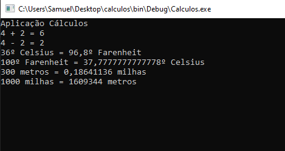

# Cálculos :1234:

 Aplicação C# para efetuar diversos tipos de cálculos.

 

 Desenvolvida no *âmbito* da +ação de formação **Introdução ao Git e GitHub**

## Operações suportadas

Nete momento esta aplicação implementa as seguintes operações:
- soma
- subtração
- conversão de temperaturas
    - celsius :arrow_right: fahrenheit
    - fahreneit :arrow_right: celsius
- Conversão de distâncias
    - metros :arrow_right: milhas
    - milhas :arrow_right: metros

## Tecnologias utilizadas neste projeto

- Visual Studio
- C#
- Git
- GitHub Desktop
- Plataforma GitHub 
